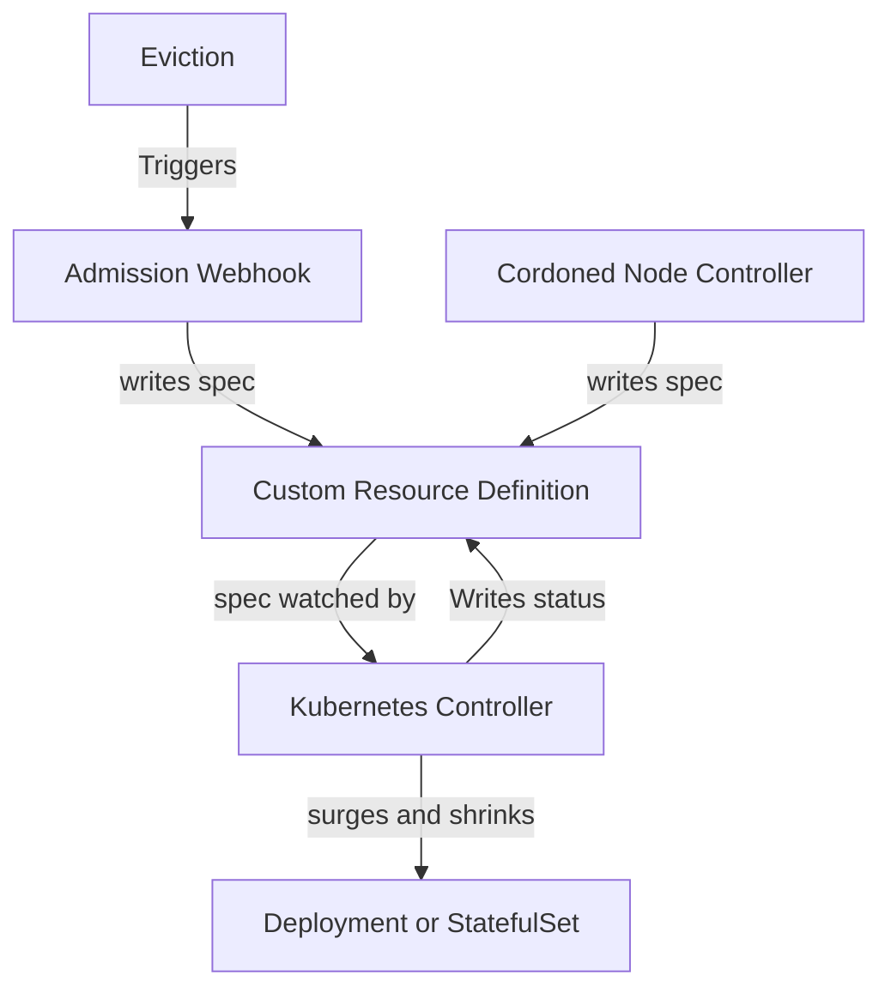

# K8s-pdb-autoscaler

[](https://goreportcard.com/report/github.com/paulgmiller/k8s-pdb-autoscaler)
[](https://pkg.go.dev/github.com/paulgmiller/k8s-pdb-autoscaler)
[](LICENSE)
[](https://github.com/paulgmiller/k8s-pdb-autoscaler/actions/workflows/ci.yml)


## Table of Contents

- [Introduction](#introduction)
- [Features](#features)
- [Installation](#installation)
- [Usage](#usage)

## Introduction

This originated as an intern project still at github.com/Javier090/k8s-pdb-autoscaler

The general idea is that k8s deployments already have a max surge concept and there's no reason that surge is only for new deployments and not for node maintenance or other situatins where pdb protected pods need to be evicted.
This project uses node cordons or alteratively an eviction webhook to signal PDBWatcher Custom Resources That maps to a PodDisruptionBudget. A controller will then try and scale up the deployment that corresponds to the poddisruptionbudget.

### Why Not Overprovision?
Overprovisioning isn't free. Sometimes it makes sense to run as cheap as you can. But you still don't want to be down because there was a cluster upgrade or even a vm maintence event.
Your app might also just be having a bad time for unrelated reasons and an the same maitence event shouldn't cost you down time if extra replicas can save you.

## Features

- Node Controller that signals all pods on the cordoned nodes selected by pdbs.
- Optional Web hook that writes evictions to pdb watcher custom resource.
- PDB Watcher Controller that wathces pdb watchers and if evictions are blocked because watchers PDB's disruptionsAllowed is zero then surge deployment.
- PDB Watcher Controller Restores deployment to original state after cooldown period if eviction signal stops. 
- Optionally a PDB Controller will create PDBWatcher Custom Resources for them.
- Optionally a Deployment Controller will create pdbs for deployments that don't have them.




## Installation

### Prerequisites

- Docker
- kind for e2e tests.
- A sense of adventure

### Install

Clone the repository and install the dependencies:

```bash
git clone https://github.com/paulgmiller/k8s-pdb-autoscaler.git
cd k8s-pdb-autoscaler
hack/install.sh
```

## Usage
Here's how to see how this might work.

```bash
kubectl create ns laboratory
kubectl create deployment -n laboratory piggie --image nginx
# unless disabled there will now be a pdb and a pdbwatcher that map to the deployment
# show a starting state
kubectl get pods -n laboratory
kubectl get poddisruptionbudget piggie -n laboratory -o yaml # should be allowed disruptions 0
kubectl get pdbwatcher piggie -n laboratory -o yaml
# cordon
NODE=$(kubectl get pods -n laboratory -l app=piggie -o=jsonpath='{.items[*].spec.nodeName}')
kubectl cordon $NODE
# show we've scaled up
kubectl get pods -n laboratory
kubectl get poddisruptionbudget piggie -n laboratory -o yaml # should be allowed disruptions 1
kubectl get pdbwatcher piggie -n laboratory -o yaml
# actually kick the node off now that pdb isn't at zero.
kubectl drain $NODE --delete-emptydir-data --ignore-daemonsets

```
Here's a drain of  Node on a to node cluster that is running the [aks store demo](https://github.com/Azure-Samples/aks-store-demo) (4 deployments and two stateful sets). You can see the drains being rejected then going through on the left and new pods being surged in on the right.


## TODO 
Mostly see issues. 

- Add these sections to the readme
  
  - [Configuration](#configuration)
  - [Examples](#examples)
  - [Contributing](#contributing)

