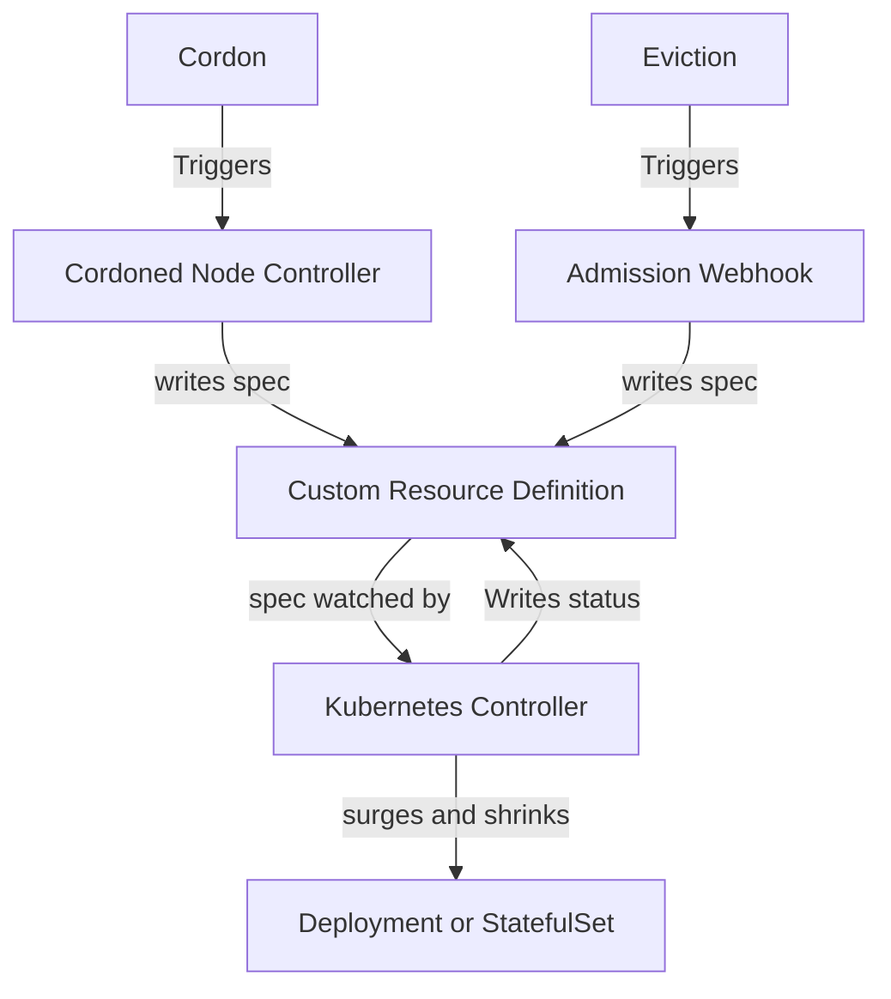

# K8s-pdb-autoscaler

[](https://goreportcard.com/report/github.com/azure/eviction-autoscaler)
[](https://pkg.go.dev/github.com/azure/eviction-autoscaler)
[](LICENSE)
[](https://github.com/azure/eviction-autoscaler/actions/workflows/ci.yml)


## Table of Contents

- [Introduction](#introduction)
- [Features](#features)
- [Installation](#installation)
- [Usage](#usage)

## Introduction

This project originated as an intern project and is still available at [github.com/Javier090/k8s-pdb-autoscaler](https://github.com/Javier090/k8s-pdb-autoscaler).

The general idea is that Kubernetes (k8s) deployments already have a max surge concept, and there's no reason this surge should only apply to new deployments and not to node maintenance or other situations where PodDisruptionBudget (PDB)-protected pods need to be evicted.
This project uses node cordons or, alternatively, an eviction webhook to signal PDBWatcher Custom Resources that map to a PodDisruptionBudget. A controller then attempts to scale up a deployment that corresponds to the PodDisruptionBudget.

### Why Not Overprovision?

Overprovisioning isn't free. Sometimes it makes sense to run as cost-effectively as possible, but you still don't want to experience downtime due to a cluster upgrade or even a VM maintenance event.  

Your app might also experience issues for unrelated reasons, and a maintenance event shouldn't result in downtime if adding extra replicas can save you.


## Features

- **Node Controller**: Signals PDBWatchers for all pods on cordoned nodes selected by PDBs.
- **Optional Webhook**: Signals PDBWatcehrs for any pod getting an evicted. See [issue #10](https://github.com/azure/eviction-autoscaler/issues/10) for more information.
- **PDB Watcher Controller**: Watches PDBWatcher resources. If there a recent eviction singals and the PDB's AllowedDisruotions is zero, it triggers a surge in the corresponding deployment.
- **Scaledown**: The PDB Watcher Controller restores the deployment to its original state after a cooldown period when eviction signals stop.
- **PDB Controller** (Optional): Automatically creates PDBWatcher Custom Resources for existing PDBs.
- **Deployment Controller** (Optional): Creates PDBs for deployments that don't already have them.




## Installation

### Prerequisites

- Docker
- kind for e2e tests.
- A sense of adventure

### Install

Clone the repository and install the dependencies:

```bash
git clone https://github.com/azure/eviction-autoscaler.git
cd k8s-pdb-autoscaler
hack/install.sh
```

TODO Add configuration options.

## Usage
Here's how to see how this might work.

```bash
kubectl create ns laboratory
kubectl create deployment -n laboratory piggie --image nginx
# unless disabled there will now be a pdb and a pdbwatcher that map to the deployment
# show a starting state
kubectl get pods -n laboratory
kubectl get poddisruptionbudget piggie -n laboratory -o yaml # should be allowed disruptions 0
kubectl get pdbwatcher piggie -n laboratory -o yaml
# cordon
NODE=$(kubectl get pods -n laboratory -l app=piggie -o=jsonpath='{.items[*].spec.nodeName}')
kubectl cordon $NODE
# show we've scaled up
kubectl get pods -n laboratory
kubectl get poddisruptionbudget piggie -n laboratory -o yaml # should be allowed disruptions 1
kubectl get pdbwatcher piggie -n laboratory -o yaml
# actually kick the node off now that pdb isn't at zero.
kubectl drain $NODE --delete-emptydir-data --ignore-daemonsets

```
Here's a drain of  Node on a to node cluster that is running the [aks store demo](https://github.com/Azure-Samples/aks-store-demo) (4 deployments and two stateful sets). You can see the drains being rejected then going through on the left and new pods being surged in on the right.


## Contributing

This project welcomes contributions and suggestions.  Most contributions require you to agree to a
Contributor License Agreement (CLA) declaring that you have the right to, and actually do, grant us
the rights to use your contribution. For details, visit https://cla.opensource.microsoft.com.

When you submit a pull request, a CLA bot will automatically determine whether you need to provide
a CLA and decorate the PR appropriately (e.g., status check, comment). Simply follow the instructions
provided by the bot. You will only need to do this once across all repos using our CLA.

This project has adopted the [Microsoft Open Source Code of Conduct](https://opensource.microsoft.com/codeofconduct/).
For more information see the [Code of Conduct FAQ](https://opensource.microsoft.com/codeofconduct/faq/) or
contact [opencode@microsoft.com](mailto:opencode@microsoft.com) with any additional questions or comments.

## Trademarks

This project may contain trademarks or logos for projects, products, or services. Authorized use of Microsoft 
trademarks or logos is subject to and must follow 
[Microsoft's Trademark & Brand Guidelines](https://www.microsoft.com/en-us/legal/intellectualproperty/trademarks/usage/general).
Use of Microsoft trademarks or logos in modified versions of this project must not cause confusion or imply Microsoft sponsorship.
Any use of third-party trademarks or logos are subject to those third-party's policies.

  

